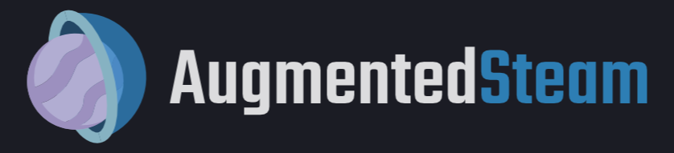
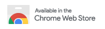

Augmented Steam is a browser extension by [IsThereAnyDeal](https://isthereanydeal.com/) that improves your experience on the [Steam](https://store.steampowered.com/) platform by providing helpful information and tons of customization options.

Some selected features:
- Price details (current best, historical low) for any game or DLC sourced from many authorized stores
- More visible highlighting of games you own or have wishlisted or ignored (also works with your IsThereAnyDeal Waitlist and Collection!)
- Fine-tuned product search with search filters such as review count / score and Early Access
- Sort and filter options for the market, games, friends, groups, achievements, badges and reviews
- Links to popular websites with additional related information, plus the ability to add your own custom links
- Quick / Instant Sell items in your inventory
- Custom profile backgrounds and styles, visible to all users of Augmented Steam
- Take and store notes about any game
- Maximize information relevance by hiding unwanted content blocks from app pages or the homepage
- Automatically skip age gates for NSFW content
- Batch actions for various scenarios, e.g. registering multiple product keys or adding multiple DLCs to your cart at once
- And many more!

Augmented Steam is a fork and spiritual successor of [Enhanced Steam](https://github.com/jshackles/Enhanced_Steam), which has come to its end of life in February 2019.  
Visit the [extension's page](https://augmentedsteam.com/) for more information.

We like to help you on our [Discord server](https://discord.gg/yn57q7f) in the `#as-general` or `#as-bugs` channels.  
If you want to report a bug, please use this repository's [issue tracker](https://github.com/IsThereAnyDeal/AugmentedSteam/issues).

This is the repository for the extension, not the [server repository](https://github.com/IsThereAnyDeal/AugmentedSteam_Server).

## Development Setup

Run `npm install` to install the required packages.

### Building

**Development build:**
Run `npm run build firefox` or `npm run build chrome`

**Production build:**
Run `npm run build firefox -- --production` or `npm run build chrome -- --production`

> *Note:* Run `npm run build -- --help` to see all available build options

## License

Enhanced Steam is Copyright 2012-2018 Jason Shackles.
This program is free software: you can redistribute it and/or modify it under the terms of the GNU General Public License v3 or newer as published by the Free Software Foundation.  A copy of the GNU General Public License v3 can be found in [LICENSE](LICENSE) or at https://www.gnu.org/licenses/gpl-3.0.html.
